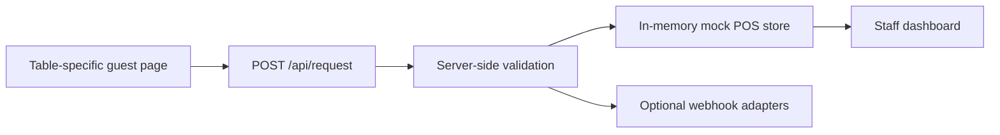

# TableTap Restaurant Service Request MVP

TableTap is a mobile-first restaurant service-request prototype. Guests open a table-specific page through a QR code, submit a request, and staff track it in a mock POS queue. The idea draws on firsthand restaurant-service experience.

**Status:** Local/demo MVP with temporary in-memory storage. This is not a production restaurant system or a verified Toast integration.

## Problem

Guests need a simple way to request refills, the check, or assistance while staff are busy. TableTap demonstrates a guest-to-staff request workflow; improvements in response time or guest satisfaction have not been measured.

## Stack and architecture

TypeScript, Next.js App Router, React and Tailwind CSS.



- `app/table/[tableId]/page.tsx`: dynamic guest pages.
- `app/api/request/route.ts`: request validation and delivery.
- `components/request-panel.tsx`: guest form, feedback and duplicate-submission lockout.
- `lib/mock-pos-store.ts`: temporary request state.
- `app/pos/` and `components/pos-dashboard.tsx`: staff queue and table views.
- `lib/integrations/`: mock POS, Discord and optional bridge adapters.

## Run locally

Use Node.js 20 or newer and npm.

```bash
npm install
cp .env.example .env.local
npm run dev
```

For a mock-only demo, set `DISCORD_WEBHOOK_URL=` in `.env.local` and leave `MOCK_POS_ENABLED=true`. Keep real secrets out of Git.

## Walk through the demo

1. Open <http://localhost:3000/table/7>.
2. Open <http://localhost:3000/pos> in another tab.
3. Submit a guest request and confirm it appears in the staff queue.
4. Move the request through New, Seen, In Progress and Done.
5. Inspect the table detail page at `/pos/table/7`.

QR codes should point to the relevant `/table/[tableId]` URL on a reachable deployment. The local URLs above are for development.

## Integrations

Discord delivery is optional through `DISCORD_WEBHOOK_URL`. Generic POS delivery uses `POS_WEBHOOK_URL` and optionally `POS_WEBHOOK_SECRET`. See `.env.example` for all configuration.

The Toast adapter sends a structured payload to a separately hosted bridge. This repository does not implement direct Toast order creation or include a working Toast integration service. See [the integration plan](docs/TOAST_INTEGRATION.md) for the proposed approach. A successful mock delivery does not demonstrate delivery to Toast.

## Checks

```bash
npm run lint
npm test
npm run build
```

The repository includes request-route tests.

## Limitations and next steps

- Requests are held in server memory and can disappear on restart or be inconsistent across server instances. Add persistent storage before a restaurant pilot.
- Staff pages have no authentication. Add authentication and access controls before production use.
- Table IDs are URL-based and are not mapped to Toast table GUIDs.
- No payments or direct Toast order creation are implemented.
- Use non-sensitive demo notes; do not enter real customer information.
- Restaurant testing and a recorded demo remain next steps.

The [manager pitch and pilot plan](docs/GM_PITCH.md) describes the intended use case, not a completed pilot.
